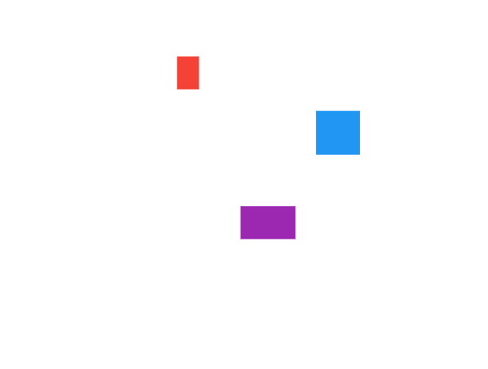

# Flutter Stack Canvas

A simple canvas for placing widgets in a free style canvas-like manner by wrapping the widget in a Canvas Object and specifying its the offset and size.

Furthermore, the canvas offers tranformation utilities to
- Scale the canvas: zoom in and out.
- Translate the canvas: move in the 4 directions.

All canvas tranformations can be animated.

See the example app for a comprehensive demo.

Inspired by [Rody Davis Jr](https://blog.codemagic.io/multi-touch-canvas-with-flutter/)

## Installation

Add `stack_canvas` as a dependency in your [pubspec.yaml](https://flutter.dev/docs/development/packages-and-plugins/using-packages) file.

Import Stack Canvas:
```dart
import 'package:stack_canvas:stack_canvas.dart;
```


## How to use

Simply use the `StackCanvas` widget to embed a new Canvas into your view. This is an empty canvas.
```dart
class MyView extends StatelessWidget {
    @override
    Widget build(BuildContext context) {
        return Container(
            StackCanvas(
                controller: StackCanvasController(),
            ),
        );
    }
}
```


Should you need to add objects (obviously), use the `StackCanvasController`. Using this controller, adding, removing, and transforming the canvas is becomes a simple task.
```dart
final StackCanvasController controller = StackCanvasController();
```
And give it to the `StackCanvas` you want to control.
```dart
StackCanvas(
    controller: controller,
),
```

Now, we can add any widgets we like by wrapping it inside a `CanvasObject`. `CanvasObject` is in fact generic and defined as `CanvasObject<T>`; however, most of times it will be `CanvasObject<Widget>, for we're using flutter.
```dart
List<CanvasObject<Widget>> objects = [
    CanvasObject<Widget>(
        dx: 100,             // Offset in x-axis
        dy: 100,             // Offset in y-axis
        width: 80,
        height: 40,
        child: Container(    // The widget to be rendered
            color: Colors.red,
        )
    )
];
```
Ofcourse you can add multiple objects at the same time using that list.

Then add these widget objects to the canvas using the controller.
```dart
controller.addCanvasObjects(objects);
```

Voilà!


## Zoom & Move


### Zoom in & out

```dart
controller.zoomIn();
controller.zoomOut();
```

| Zoomed In | Zoomed Out |
|:---------:|:----------:|
|  |  |


### Move in 4 directions
```dart
controller.moveUp();
controller.moveDown();
controller.moveLeft();
controller.moveRight();
```


## Customizing the Canvas

Here are all the customizable properties with their default values
```dart
StackCanvas(
    width: double.maxFinite,      // Full width
    height: double.maxFinite,     // Full height
    backgroundColor: Colors.white,
    animationDuration: Duration(milliseconds: 400),
    controller: controller,
    disposeController: true,      // If set to false, you need to dispose the controller by yourself
)
```
```dart
StackCanvasController(
    zoomChangeUnit: 0.10,         // The speed of zooming  (scale factor)
    moveChangeUnit: 30.00,        // The speed of movement (translation value)
)
```

https://user-images.githubusercontent.com/50919012/118004334-aa88ab00-b349-11eb-8255-c2debd185eb3.mp4

